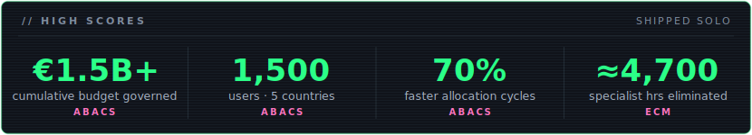

<!-- ============================================================
     Phaneendra Bheesetti — GitHub profile
     Dark retro-gaming / CRT terminal theme. Design lives in the
     committed SVGs under assets/; the Markdown below carries every
     fact so the page still reads perfectly if images fail to load.
     ============================================================ -->

Senior Full-Stack & AI Engineer with 6+ years architecting systems end-to-end — and now building the AI layer on top of them. At BMW (via Alten) I drive full-stack delivery and the team's **AI initiatives**: agent-based development workflows, **MCP servers** connecting internal systems to AI tooling, and GitHub Copilot practice — on a large Nx monorepo of engineering-data visualization tools (Angular, Express, AWS DynamoDB + S3, Terraform). Also solo-founding [KodeRyu](https://koderyu.com), a live AI voice interviewer. IIT Madras alum. I care as much about the trade-off behind a decision as the code that implements it.

- Open to **Senior Full-Stack & AI Engineering** roles (Bangalore or remote)
- TypeScript-first — Angular · React · Node · Postgres — with an AI layer of Claude API, MCP, agents, and LLM eval pipelines

 

| System | Scale | Impact |
| --- | --- | --- |
| **ABAcS** — budgeting platform, *sole architect* | €500M+/yr governed · €1.5B+ cumulative · 1,500 users · 5 countries | **70% faster** allocation cycles · audit prep **days → hours** · work conventionally staffed by a 3–5 engineer team, delivered solo |
| **ECM** — document publishing desktop app | 2,000+ classified docs published to date | **2–3 hrs → 10–15 min** per doc (≈90%) · **≈4,700 specialist hours eliminated** · one publisher does a manual team's work |
| **MPO** — maintenance-program optimization (Skywise/Palantir Foundry) | 8,000+ operator accounts · a multi-million-euro annual cost-avoidance & service-revenue business case | Owned the digitally-signed PDF dossier — **the revenue-carrying deliverable** operators receive · incident focal, **15+ critical defects** resolved |
| **Quality Tracker** — supply-chain quality | 500+ users · 5 countries · solo build in 2 months | Approval cycle **1–2 days → 2–3 hrs** (≈85–92%) · zero bug-induced downtime · handed to a team that extended it |
| **CCT** — composite compatibility | Aircraft manufacturing · 2-engineer build | Composite-material testing cycle **cut 80%** |
| **MyMetrics** — PnL/risk platform (Société Générale) | 60K-line codebase · global bank's Finance Risk division | SonarQube **D → A+ in 10 months**, single-handed · 5 new risk-dashboard APIs |

*Airbus work is under Alten contracts in internal repositories — described here, not linked. Exact internal business-case figures stay private; the public numbers above are sanitized.*

 

An AI voice interviewer that conducts real spoken technical interviews — voice, DSA, and system-design practice — **live at [koderyu.com](https://koderyu.com)** and heading to public launch. Built solo, end to end:

- **Real-time voice engine** — holds a natural spoken interview: streaming speech-to-text (Deepgram) into an LLM and back to speech (self-hosted Kokoro TTS) fast enough to feel like live conversation, recovering when candidates interrupt and hinting progressively when they're stuck.
- **Sandboxed code execution** — runs untrusted candidate code in **5 languages** (Python, JavaScript, Java, C++, Go) inside a Docker + nsjail sandbox on a BullMQ worker pool, with **sub-second cold starts**.
- **AI grading** — matches human expert graders (**κ=0.92** agreement on a 13-criterion rubric), regression-tested by simulating 12 distinct candidate types.
- **Full SaaS, shipped solo** — Clerk auth, Razorpay tier-gated payments, an OWASP Top 10 security pass, and PostHog + Sentry + GA4 telemetry.

> KodeRyu's source is private during beta — the live app is at [koderyu.com](https://koderyu.com). A public case study lands here at launch.

**How I work** — Solo, end-to-end, from the data model to the on-call rotation. The systems I own move real money or throughput, cut cycle times by an order of magnitude, and stay in production after I hand them off.

*Most of my strongest work is enterprise and lives behind internal git, so my public contribution graph doesn't tell the whole story — the track record above and the pinned repos below do.*

 

**Languages & data** — TypeScript · JavaScript · Python · Java · SQL · PostgreSQL · MongoDB · Redis · Kafka

**Frameworks & infra** — Angular · React · Next.js · Node · Express · FastAPI · Electron · Prisma · Redux Toolkit · Zustand · Tailwind · Nx · Docker · nsjail · BullMQ · AWS (DynamoDB · S3 · Lambda) · Terraform · Jenkins

**AI engineering** — AI agents & agentic workflows · MCP server development · Claude API · Claude Code · GitHub Copilot · LLM evaluation harnesses · Deepgram STT · Kokoro TTS

**Testing & telemetry** — Vitest · Playwright · Jest · PostHog · Sentry · GA4 · SonarQube

 

- **LinkedIn** — [linkedin.com/in/phaneendra-bheesetti](https://www.linkedin.com/in/phaneendra-bheesetti)
- **Email** — phaneendra.bheesetti36@gmail.com
- **Portfolio** — [phaneendra-portfolio.pages.dev](https://phaneendra-portfolio.pages.dev)
- **KodeRyu** — [koderyu.com](https://koderyu.com)

 

© 2026 · ● SYSTEM ONLINE
